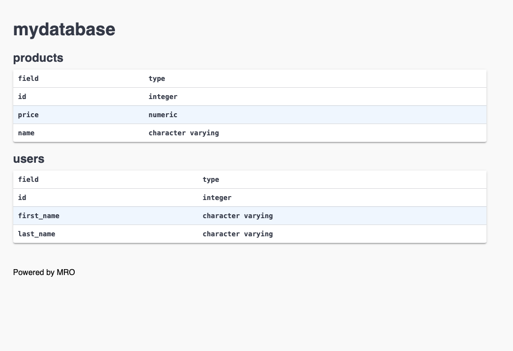

# Document a Database Using HTML

This image illustrates the process of documenting a database using HTML. Click on the image to view it in full size. Below, you can find additional details and steps to replicate the process.

## Resources
- [HTML File](./mydatabase_mro_docs.html)