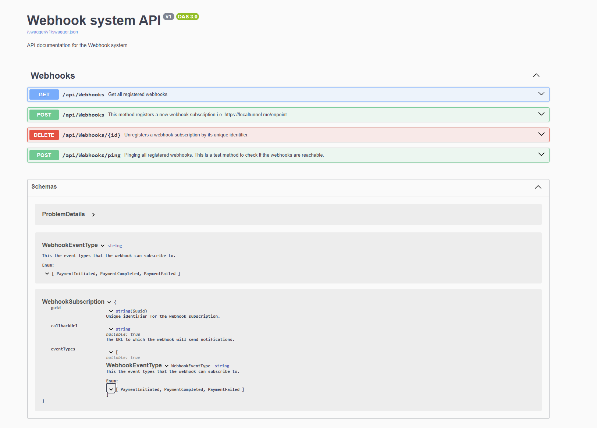

# Webhook System

This project provides a simple webhook registration system with endpoints for registering, unregistering, and testing webhooks.

The webhook system allows clients to subscribe and receive real-time updates for specific events via webhooks.

---

## Features
- **Register Webhooks**: Add a webhook with a callback URL and event types.
- **Unregister Webhooks**: Remove a webhook using its unique identifter.
- **Ping Webhooks**: Test all registerd webhooks by sending a test message.

---

## API Documentation
The system includes Swagger for interactive API documentation. You can use it to explore it and to test the API endpoints.

### Accessing Swagger UI
- The application is hosted on Azure and you can interact with it using the following link: [Swagger UI](https://webhoob20250501214221-cad2cdb4hncsg6bu.northeurope-01.azurewebsites.net/index.html) 

- 

---

## Endpoints overview
- **Base URL**: 
    ```URL
    https://webhoob20250501214221-cad2cdb4hncsg6bu.northeurope-01.azurewebsites.net
    ```

### 1. Get all registered webhooks
- **Endpoint**: `GET /api/Webhooks`
- **Description**: Retrieve all registered webhooks.

### 2. Register a Webhook
- **Endpoint**: `POST /api/Webhooks`
- **Description**: Register a new webhook.
- **Request Body**:
  ```json
  {
    "callbackUrl": "https://example.com/webhook",
    "eventTypes": ["PaymentInitiated", "PaymentCompleted"]
  }

### 3. Unregister a Webhook
- **Endpoint**: `DELETE /api/Webhooks/{id}`
- **Description**:  Unregisters a webhook by its unique identifier.

### 4. Ping Webhooks
- **Endpoint**: `POST /api/Webhooks/ping`
- **Description**:  Sends a test message to all registered webhooks.


## Testing Webhooks locally

To test the webhook system locally, you can set up a FastAPI server to receive webhook events and expose it to the internet using `localtunnel` or similar

### Steps to set up

1. **Create a Webhook Receiver**:
   Use the following Python code to create a simple webhook receiver with FastAPI (or a similar framework):


    ```python
    from fastapi import FastAPI, Request
    import json

    app = FastAPI()

    @app.post("/mywebhook")
    async def webhook(request: Request):
    data = await request.body()
    print(json.loads(data))
    return
    ```
2. **Run the local server:** start the FastAPI server by choosing  the port

3. **Expose the server to the internet:** Use `localtunnel` to expose your local server to the internet:
    ``` bash
        # lt --port <port-number from the local server> --subdomain your subdomain name
        $ lt --p Port -s YOUR_SUBDOMAIN 
    ```
4. **Register the Webhook:** Create a ``POST`` request to the ``Register a Webhook`` endpoint as explained in the Endpoints Overview section. Use the following Python code to register your webhook:

    ```python
    import httpx

    @app.post("/register")
    async def register():
        url = "https://webhoob20250501214221-cad2cdb4hncsg6bu.northeurope-01.azurewebsites.net/api/Webhooks"
        payload = {
            "callbackUrl": "https://rasho.loca.lt/mywebhook",
            "eventTypes": [
                "PaymentInitiated",
                "PaymentFailed"
            ]
        }        
        headers = {
            'Content-Type': 'application/json'
        }
        async with httpx.AsyncClient() as client:
            response = await client.post(url, headers=headers, json=payload)
            print(response.status_code)
            print(response.text)
    ```

