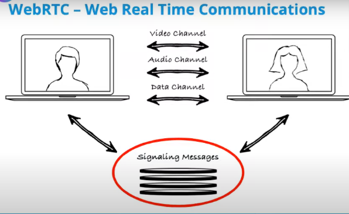

# EKSAM QUESTION

## Uge 8:

* **Understand WebRTC on a surface level instead of on a protocol level.**
    - **What is WebRTC?**
        * WebRTC (Web RTC = Real-Time Communication) enables real-time peer-to-peer communication between browsers or devices, supporting audio, video, and data sharing without plugins.

    - **Supported Programming Languages**: JavaScript, WebAssembly

    - **Supported Protocols**:

        | Protocol     | Directionality            | Statefulness |
        |-------------|---------------------------|-------------|
        | HTTP         | Unidirectional           | Stateless   |
        | SSE          | Unidirectional           | Stateful    |
        | WebSocket    | Bidirectional            | Stateful    |
        | WebTransport | Bidirectional            | Stateful    |
        | WebRTC       | Bidirectional/Unidirectional | Stateful |
        | QUIC         | Multiplexed, Bidirectional | Stateful |

    - **Key Features of WebRTC**:
        * Peer-to-peer communication.
        * Low latency for real-time interactions.
        * Built-in support for audio, video, and data channels.

* **Comparison: WebSocket vs WebRTC**
    - **WebSocket**:
        * Client-server protocol for full-duplex communication.
        * Ideal for chat apps or real-time notifications.

    - **WebRTC**:
        * Peer-to-peer communication optimized for real-time audio, video, and data sharing.
        * Ideal for video conferencing, file sharing, or multiplayer gaming.

    - **Key Differences**:
        * WebSocket is client-server; WebRTC is peer-to-peer.
        * WebRTC is optimized for media streaming; WebSocket is better for general-purpose data exchange.
    - **Underlying Network Protocol**
        * WebSocket uses TCP.
        * WebRTC uses UDP for media and SCTP for data channels.

    - **Communication**
        * WebSocket requires a server to relay messages between clients.

        * WebRTC allows clients to communicate directly.

        * WebRTC requires clients to exchange metadata in order to establish a connection. In principle, this could be done without any servers. In practice, a server is used to pair clients.

    - **WebSocket vs. WebRTC Architecture**
        * [Link til architecture](https://requestum.com/blog/webrtc-vs-websockets)

        * [source ](https://www.youtube.com/watch?v=4dLJmZOcWFc)
         - 
        
        * The **STUN** server hleps you know what ip address to connect to them, which when we have peer-to-peer connection directly between to two parties/bowser then we need to have a unique identifier/IP for each of those parties in order to establish the connection - that is ip address.

        * **TURN** If a browser's network masks the true IP address for a user then a STUN server can't supply specific enough infor to stablish a Peer to Peer connection and your WebRTC video will fail -  TRUN servers are then used as a backup to reach the user
     
* **Understands what OpenAPI is and why it exists.**
    - **What is OpenAPI?** 
        * OpenAPI is a specification for describing RESTful APIs in a standardized format, making it easier for developers to understand and use APIs.

    - **Key Points:**
        *  **Swagger**: Originally the name of the specification and the company behind it.
        * **Version History**: OpenAPI began with version 3.0, and updates have continued to version 3.1.0, which added support for JSON Schema.
        * **File Syntax**: OpenAPI uses YAML (Yet Another Markup Language), which is human-readable and easy to write.

    - **Why Does OpenAPI Exist?**
        * To provide a clear and consistent way to describe APIs.
        * To facilitate better API documentation, client generation, and automated testing.

# Explanation of the code section

## How does **STUND** Server works?

- When we say "First peer creates an offer in the form of an SDP object (Session Description Protocol)," it refers to a key step in establishing a WebRTC connection between two peers (e.g., two web browsers). Here’s a breakdown of what this means:

### What is SDP (Session Description Protocol)?
SDP is a format used to describe multimedia communication sessions. It includes information about the media types (audio, video), codecs, network information, and other parameters necessary for establishing a connection.

### The Offer Process

1. Initiating the Connection:
    - In a WebRTC scenario, one peer (let's call it Peer A) wants to start a communication session with another peer (Peer B).

2. Creating the Offer:
    * Peer A creates an "offer" that includes an SDP object. This offer contains details about:
        - The media types it wants to send (e.g., audio, video).

        - The codecs it supports (e.g., VP8 for video, Opus for audio).

        - Network information, such as the IP address and port it will use for sending media.

3. Sending the Offer:
    * Peer A sends this SDP offer to Peer B through a signaling mechanism (like a WebSocket or another server).

4. Receiving the Offer:
    * Peer B receives the SDP offer and can then analyze it to understand what Peer A is proposing for the communication session.
5. Responding with an Answer:
    * Peer B will create an "answer" in the form of its own SDP object, which includes its media capabilities and preferences. This answer is then sent back to Peer A.

**Summary**:  
In summary, when we say that the first peer creates an offer in the form of an SDP object, it means that the initiating peer is defining the parameters of the communication session it wants to establish, including what media it will send and how it will do so. This is a crucial step in setting up a WebRTC connection, allowing both peers to agree on the details of their communication.

## How does SDP and STUN works together to stablish the communication? 

When you create a media call (like a video or audio call) in a browser using WebRTC, the process typically involves the following steps:
1. STUN Server: The browser uses a STUN server to discover its public IP address and port, which is essential for establishing a direct peer-to-peer connection.

2. SDP Offer: The initiating peer (e.g., the caller) creates an SDP offer that describes the media capabilities (like audio and video formats) and sends it to the other peer (the receiver).

3. SDP Answer: The receiving peer analyzes the offer and responds with an SDP answer, indicating its own media capabilities and preferences.

4. Peer-to-Peer Connection: Using the information from the STUN server and the SDP exchange, both peers establish a direct connection to communicate in real-time.

**In summary**, the STUN server helps facilitate the connection, while SDP is used to negotiate the details of the media session